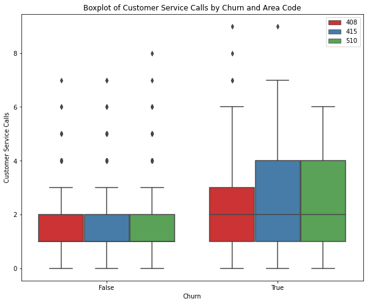
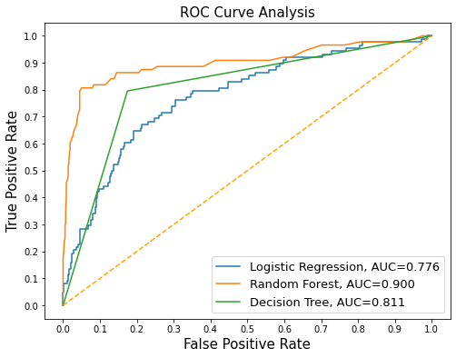

                      Syriatel Customer Churn Prediction Project 

                                   Overview

This binary classification project focuses on conducting a churn analysis for SyriaTel, a telecommunications company based in Syria. The objective is to uncover the factors influencing customer churn and to build a classifier capable of predicting which customers are prone to churn. By identifying these customers in advance, SyriaTel can take proactive measures to mitigate customer attrition and retain their client base effectively.

                              Goal of the project
                            

The goal is to create a machine learning model capable of predicting the likelihood of a customer discontinuing a service, as well as identifying the factors contributing to this churn.

                                Objectives
- To find out why customers are leaving.
- To see which factors affect customer leaving the most.
- To make a model that can predict if a customer might leave.
- To check how well the model works and compare it with others.
- To find ways to stop customers from leaving and keep more of them.
- To make a plan to use the ideas from the model to stop customers from leaving.
- To watch and see how well the plan works over time in stopping customers from leaving and how it affects the business.

                             Business Understanding.

Syriatel faces a challenge: a significant number of customers are departing for rival companies. To tackle this, they aim to develop a tool capable of forecasting customer churn. By analyzing their data to discern the reasons behind customer departures, they plan to construct a predictive model to anticipate when a customer might defect. This initiative is designed to empower Syriatel to proactively address customer concerns, enhance satisfaction, and prevent churn.
                             
                               Data Exploration
     
This project uses the SyriaTel Customer churn data set which is retrieved from Kaggle: https://www.kaggle.com/datasets/becksddf/churn-in-telecoms-dataset. The data used has been sourced from Kaggle. The dataset contains a record of 3333 rows and 21 columns (4 are categorical and 17 are numerical ) containing different features.

                           Data Cleaning and Data analysis

I examined the dataset to identify any instances of missing or null values and duplicates but there were not missing values and duplicates.
I did Univariate , Bivariate and Multaviriate analysis to provide a comprehensive understanding of the dataset, uncover underlying patterns and relationships, and inform further modeling and decision-making processes.

                             Uvivariate Analysis   

    )

From the graph depicted above, it can be observed that approximately 483 customers out of the total 3333 in the dataset have terminated their contracts with the telecommunication company.
I also came up with histogram illustrating the distribution of all numerical features, revealing that the majority of features exhibit a curve resembling a normal distribution.

                            Bivariate Analysis

After analyzing two features to investigate their relationship and understand how changes in each feature influence the other, I examined the boxplot below. From this visualization, I can infer that the majority of customers who have terminated their contracts belong to the area codes 415 and 510.
                 
                 

                            Modelling

To achieve the stated goals outlined in the project proposal, we intend to utilize various machine learning algorithms in combination.
 The projects used the following Binary classifiers

Logistic Regression
Decision Trees
Random Forest

During the evaluation of our model performances, we will utilize the ROC_AUC metric as a crucial evaluation criterion. The ROC_AUC metric is particularly suitable for binary classification tasks, as it offers a comprehensive assessment by considering both sensitivity and specificity across different threshold levels. This metric provides a robust indication of the model's capability to distinguish between classes.

                            Logistic Regression

The logistic regression model did a good job with a recall score of 0.76, especially considering it's just a basic model. This score means it can spot about 76% of the real positive cases accurately. Even though it's a simple model, it's effective at finding the important cases, which makes it useful for predictions.

Looking at the confusion matrix, the model gets a lot of predictions right, both when it predicts something is positive and when it predicts something is negative. This suggests that the model is reliable and doesn't make too many mistakes. It's good at classifying both positive and negative cases accurately.

                             Decision Trees

The model achieved a perfect training accuracy of 1.0, meaning it accurately predicted all the samples in the training data. However, the testing accuracy, which is 0.904, suggests that the model performed slightly worse on unseen data. This drop in accuracy from training to testing data might indicate some overfitting, where the model has learned to memorize the training data rather than generalize well to new data. Despite this, a testing accuracy of 0.904 still indicates strong performance, meaning the model accurately predicted about 90.4% of the samples in the test dataset.

                                Random Forest

- The random forest classifier model demonstrates an improved recall score of 0.79, indicating a significant enhancement over its previous performance. This suggests that the model accurately identifies approximately 79% of the actual positive instances.

- Upon examining the confusion matrix, it is clear that the model achieves a higher count of true positives and true negatives compared to false positives and false negatives. This highlights the model's strong performance, as it makes correct predictions more often than incorrect ones, suggesting it successfully avoids overfitting.

                            Model comparison

ROC Curve-Is a valuable tool for understanding and evaluating the performance of binary classification models, especially in scenarios where the balance between sensitivity and specificity is critical.

 

 The analysis of ROC curves reveals varying performance levels among the classifiers, with RandomForestClassifier demonstrating the most robust performance, followed by DecisionTreeClassifier and LogisticRegression, in descending order. Notably, RandomForestClassifier achieves the highest AUC score of 0.900, indicating superior discrimination between positive and negative instances. Conversely, the LogisticRegression model attains the lowest AUC score at 0.776.

The ROC curve visually illustrates the trade-off between the true positive rate (TPR) and the false positive rate (FPR) for a binary classifier. TPR measures the accuracy of positive instance predictions, while FPR indicates the rate of misclassification for negative instances. The AUC, representing the area under the ROC curve, provides a comprehensive metric for evaluating classifier performance.

                               Conclusion

Based on the findings, the business conclusion is as follows:

- Emphasis on Recall: In the realm of predicting customer churn, priority was given to optimizing for Recall. This strategy aimed to minimize the misclassification of churners as non-churners, ensuring that the model effectively identifies customers at risk of leaving.

- Optimal Model: Among the explored models, the Random Forest classifier stood out as the top performer, 

- Key Churn Influencers: Factors such as total day charge, customer service calls, and the number of voice mail messages emerged as significant contributors to customer churn.

- With additional time, there's an opportunity to conduct a thorough exploration of potential features and their influence on the model. This may involve analyzing customer behavior, transaction patterns, or other relevant variables that could contribute valuable information for predicting churn.

- Continuous Improvement: Predicting customer churn is an ongoing endeavor, necessitating constant refinement of the model. Regular monitoring, data collection, and incorporating feedback from stakeholders are crucial for enhancing predictive accuracy and identifying at-risk customers effectively.

                                Recommendation
- To address the observed higher churn rates in area codes 415 and 510, it's advised to deploy focused promotional tactics. This entails extending targeted discounts and promotional deals to customers within these regions. By offering incentives like exclusive discounts, the objective is to cultivate customer loyalty and deter churn. This tailored strategy acknowledges the distinct attributes and issues associated with these particular geographical areas.

- In states exhibiting notably elevated churn rates like Texas, New Jersey, Maryland, Miami, and New York, it's recommended to adopt a targeted approach to customer retention. This could include executing personalized marketing efforts, customized promotional deals, and improved customer support programs. Identifying and catering to the unique requirements and preferences of customers in these states is essential for building stronger relationships and mitigating churn.

- An assessment of the current pricing framework for day, evening, night, and international rates is advised. Given the influence of charges on customer churn decisions, it's proposed to examine potential modifications to pricing schemes or the introduction of discounted bundles. This strategic review of pricing aims to rectify any inconsistencies and enhance the competitiveness of the company's offerings, thereby alleviating factors contributing to customer churn.

- The company should ensure continoous prediction of the factors influencing churn by contionously collecting new data and improving the model as prediction is an ongoing process.   

                                       